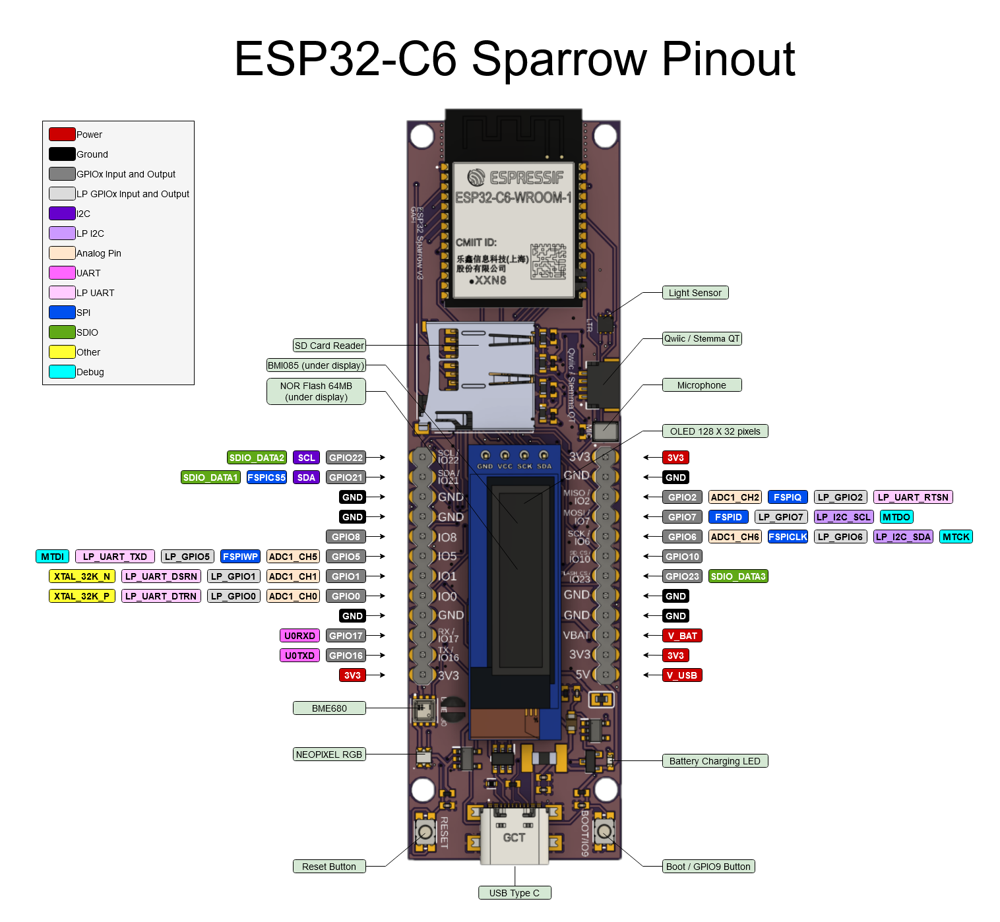

# ESP32-C6 Sparrow Board

The ESP32 Sparrow board is an IoT device designed for projects that require low battery consumption. It is built around the ESP32-C6 module, which features Zigbee and Thread compatibility.

## Pinout

## Components

Its other features include:

- **Display:** DFR0647 - Data display (I2C)
- **Memory:** W25Q512JVEIQ - 64 MB Flash memory (SPI)
- **Memory:** 112A-TAAR-R03 - SD card slot for external storage (SPI)
- **Sensor:** BME680 - Temperature, humidity, pressure, and air quality sensor (I2C)
- **Sensor:** BMI085 - 3-axis accelerometer and gyroscope (I2C)
- **Sensor:** LTR308 - Ambient light sensor (I2C)
- **Microphone:** ICS-43434 - High-quality digital microphone (I2S)
- **LED:** WS2812B2020 - Neopixel RGB LED (GPIO)
- **Communication:** PRT-14417 - Qwiic/Stemma QT connector (I2C)
- **Voltage Supervisor:** BD5229G-TR - Shuts down microcontroller below 2.9V
- **USB C:** USB4110-GF-A - USB C connector for programming/charging
- **Power:** 18650 Battery - Holder on the back

## Pins for each component

**1. MicroSD Card Holder**

| PIN NAME            | GPIO Pin   |
|---------------------|------------|
| SD_CS               | GPIO10     |
| MOSI                | GPIO7      |
| MISO                | GPIO2      |
| SCK                 | GPIO6      |

**2. NOR Flash SPI**

| PIN NAME            | GPIO Pin   |
|---------------------|------------|
| FLASH_CS            | GPIO23     |
| MOSI                | GPIO7      |
| MISO                | GPIO2      |
| SCK                 | GPIO6      |

**3. I2C Sensors**

| PIN NAME    | GPIO Pin |
|-------------|----------|
| SCL         | GPIO22   |
| SDA         | GPIO21   |

**4. I2C Bus Addresses**

| CHIP                | Address |
|---------------------|---------|
| BMI085 Accelerometer| 0x18    |
| BMI085 Gyroscope    | 0x68    |
| BME680              | 0x76    |

**5. Neopixel RGB LED**

| PIN NAME | GPIO Pin |
|----------|----------|
| NEOPIXEL | GPIO3    |

**6. Microphone ICS-43434**

| PIN NAME | GPIO Pin |
|----------|----------|
| MIC_WS   | GPIO20   |
| MIC_SCK  | GPIO18   |
| MIC_SD   | GPIO19   |

**7. Other pins**

| PIN NAME               | GPIO Pin |
|------------------------|----------|
| IO / BOOT Button       | GPIO9    |
| UART_TX                | GPIO16   |
| UART_RX                | GPIO17   |
| Battery Level          | GPIO4    |
| Accelerometer Interrupt| GPIO11   |
| LTR308 Interrupt       | GPIO15   |